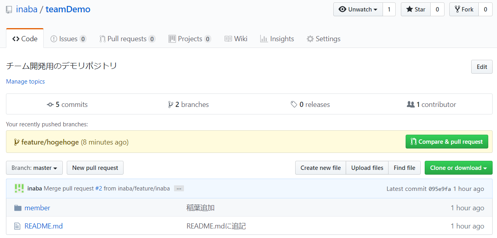
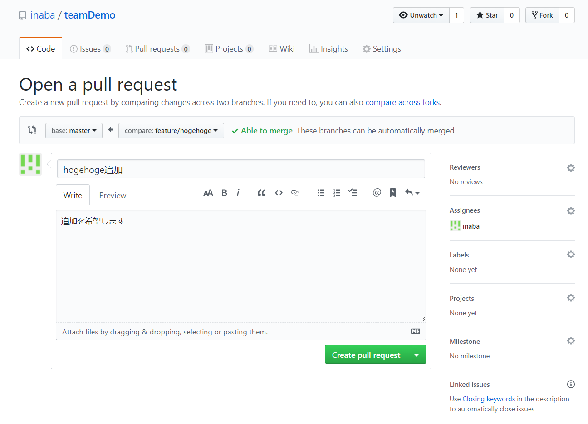
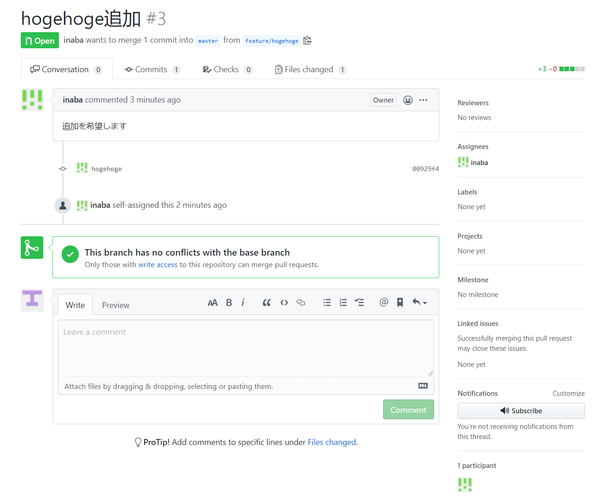
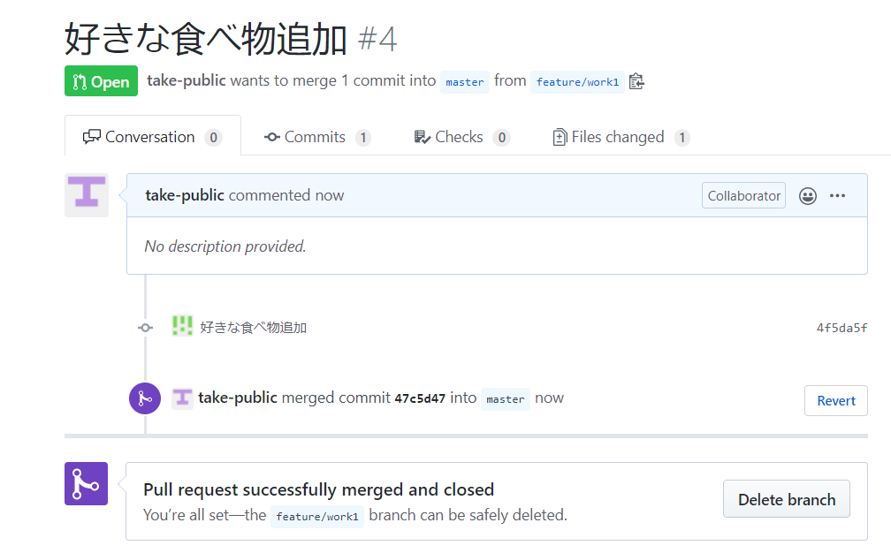
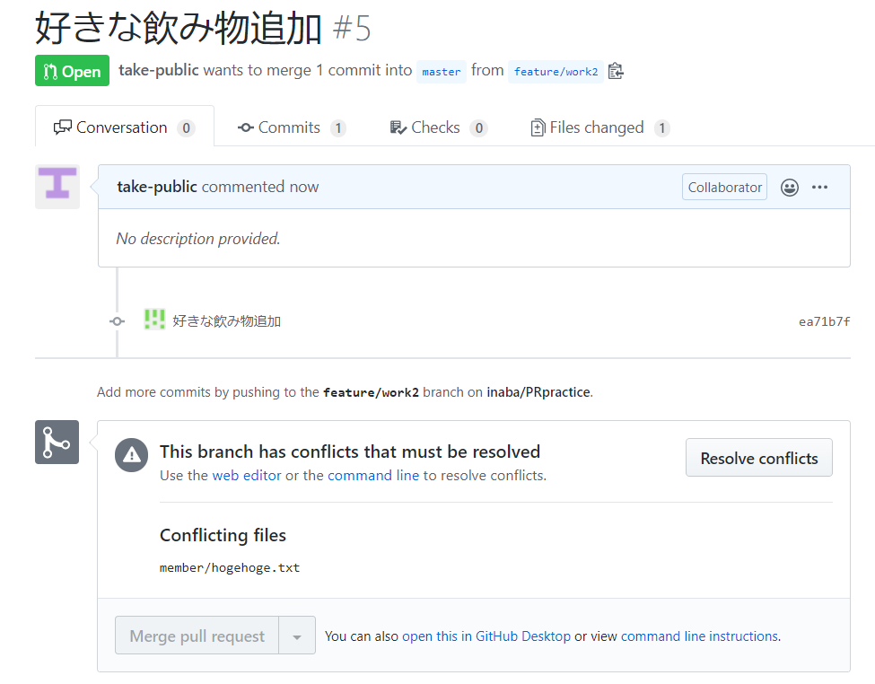
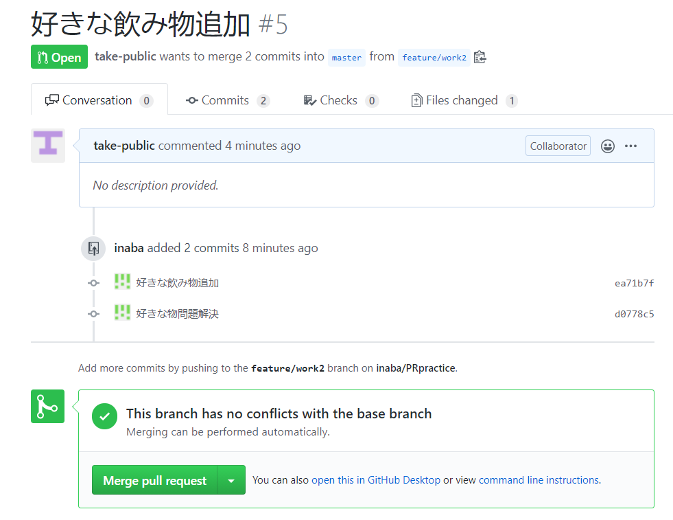

# PRpractice
チーム開発の練習用リポジトリ


## はじめに

チームでコードを書く手順を確認するためのリポジトリです。

gitについては下記あたりを参考にしていただければと思いますが、すべてを使うわけではないので、軽くでいいと思います。

> add, commit, push, pull, branch, checkoutくらいのでとりあえずは進めるはずです。というかそれ以上は私もあんまりなので一緒に勉強しましょう。

[サル先生のGit入門](https://backlog.com/ja/git-tutorial/)

↓にデモを用意しましたので、はじめにそちらを触ってみていただければなんとなく流れがわかるんじゃないかなと思います。デモはサル先生のGit入門プルリクエスト編を参考に作成しています。

> 参考URLにあるように基本的にこのデモは一人でもできますが、あえて複数人で管理するリポジトリに入れることでなんとなく臨場感が変わるのではないかと思って用意しました。

なおデモ後、リポジトリは動作確認用なので何をやっていただいてもかまいません。ただし基本的にはプルリクエスト経由でマージすることを縛りにしたいと思います。


##  ブランチモデルについて

一番単純な**Github flow**での管理のデモをしたいと思います。

フローの内容について詳細は割愛しますが、参考URLを下記に示しますので適宜参照してください。

[【図解】git-flow、GitHub Flowを開発現場で使い始めるためにこれだけは覚えておこう]([[図解]git-flow、GitHub Flowを開発現場で使い始めるためにこれだけは覚えておこう：こっそり始めるGit／GitHub超入門（終） - ＠IT (itmedia.co.jp)](https://atmarkit.itmedia.co.jp/ait/articles/1708/01/news015.html))


基本的なブランチの役割は2つです。

**master**: 常にプログラムの動作が確認されているブランチ。基本的にはPR～Mergeでしか更新されない。プッシュしないこと。

**features**: 実際に作業を行うブランチ。必ずmasterからブランチを切る。ブランチ名称はなんでもよい。


ちなみにほかにもGit flow, Gitlab flow, Git feature flowなどいろいろなブランチ構成が提案されています。参考URLは下記です。

[Gitの運用方法の有名な３パターンについての考察 | こへいブログ (kohei.life)](https://kohei.life/git-flows/)


## ルール

### 1. masterブランチにはコミットしない

masterの更新は基本的にはプルリクエストmergeによってのみ行います。一応保護をかけているのでmasterにプッシュすると失敗する。。。はずです。

### 2. 作業するときはまずブランチを切る

各自作業に当たってはまずfeaturesブランチ（名前を付けてください）を切ってチェックアウトして作業してください。

### 3. Folkはしない

プルリクエストはFolkしたリポジトリからもできますが、今回はより軽量な形の確認のためFolkはしない形式で作業を行ってみたいと思います。

> 現段階はFolkしませんが、もしかしたら外すかもしれません。


## 環境

最低限gitが必要になります。Windows PCの場合は[git for windows](https://gitforwindows.org/)などをインストールしてください。なお組み込みでgitが使えるアプリケーションがある場合はそちらを使っていただいて構いませんが説明は基本的にコマンドで行います。

GUIでのGitクライアントアプリについては下記あたりが良いかと思います。

- [Git GUI](https://git-scm.com/book/ja/v2)
- [Sourcetree](https://www.atlassian.com/ja/software/sourcetree) (アカウント作成が必要？)
- [GitKraken](https://www.gitkraken.com/) (一部有料)


## 例題

動きを体験するためのデモを用意しました。まずはこれをやってみてgithub上でのコミュニケーションを体験していただければと思います。

### STEP1 プルリクエストを体験してみる

#### 1. クローン

まずgithubからcloneしてください。

```shell
git clone https://github.com/toruinaba/PRpractice
```

> コマンド実行の場合、今いる階層にリポジトリがクローンされます。

#### 2. ブランチの作成

自分の作業用のブランチを作成します。ここでは自分の名前にしましょう。

```shell
git branch feature/hogehoge
```

#### 3.チェックアウトでブランチを切り替え

作業をするためにブランチを切り替えます。

```shell
git checkout feature/hogehoge
```

#### 4. コーディング

ここで実際に作業をします。今回は指定ディレクトリ内に自分の名前のテキストファイルを作成しましょう。

```shell
teamDemo/
	├ member/
	│	├ hogehoge.txt # ここに「名前.txt」でテキストファイルを作成
	│	...
	...
	└ README.md
```

中身は下記としてください。

```shell
名前：hogehoge
グループ：hogehogeグループ
備考：なし
```

この状態でコミットします。

```shell
git add *
git commit -m "hogehoge"
```

#### 5. プッシュ

github上のリポジトリにプッシュしましょう。クローンしてきているのでリモートのリポジトリはすでに登録済みです。下記でリモートの名称（origin）とURLが確認できます。

```shell
git remote -v
# origin https://github.com/toruinaba/PRpractice.git (fetch)
# origin https://github.com/toruinaba/PRpractice.git (push)
```

プッシュは下記で行います。

```shell
git push origin hogehoge
```

#### 6. githubのリポジトリでプルリクエストを作成

[リポジトリ](https://github.com/toruinaba/PRpractice)にアクセスすると下図の黄色い四角のようにプルリクエストが作成できるようになっています。



Compare&pull requestボタンでプルリクエストを作成してください。なお右側のReviewersやAssigneesで見てほしいユーザーや担当者を指定できます。



プルリクエストが作成されるとマージを待つ画面になります。この段階でコメントのやり取りとかができるので、実際に作成したコードの説明や議論がgithub上で行えます。



プルリクエストが承認されたら, 変更の結果がmasterにマージされます。これで作成したテキストファイルがgithubのmasterブランチに反映されることになります。今回はコラボレーターに登録されているので自分でプルリクエストを承認します。

>  なお, その後作業したブランチは不要になりますのでgithub上のdelete branchボタンで削除してしまって構いません。

#### 7. ローカルを更新

続けて作業する場合はローカルのmasterブランチを更新します。まずブランチをmasterにチェックアウトしてください。

```shell
git checkout master
```

この状態でプルを行うことでリモートのマージまでの処理がローカルに反映されます。

```shell
git pull
```

新しいコードを書き始める場合は1と同様に再度ブランチを切って作業を開始してください。

```shell
git branch feature/hogehoge2
```

### STEP2 コンフリクトを体験してみる

続いて複数人の開発で必ず起きる「同じ部分を修正していてかぶってしまった場合（コンフリクト）」を想定したデモです。今回は1人2役でブランチを分けて疑似的に競合させます。STEP1の続きとして行われる想定です。

#### 1. 作業ブランチを2つ作成

作業する用のブランチをmasterから2つ切ります。

```shell
git checkout master
git branch feature/work1
git branch feature/work2
```

#### 2. 1つ目のブランチでテキストファイルを変更してコミット

一つ目のブランチにチェックアウトします。

```shell
git checkout feature/work1
```

この状態でSTEP1で用意した名前.txtの中身を変更します。作業ブランチ1では好きな食べ物を追加しましょう。

```shell
名前：hogehoge
グループ：hogehogeグループ
好きな食べ物：カレー # ここを追加
備考：なし
```

この状態でコミットします。

```shell
git add *
git commit -m "好きな食べ物追加"
```

#### 3. 2つ目のブランチでテキストファイルを変更してコミット

続いて2つ目のブランチにチェックアウトします。

```shell
git checkout feature/work2
```

チェックアウトすると名前.txtの中身がSTEP1の状態に戻っています。今回は意図的にコンフリクトさせるので好きな飲み物を追加しましょう。

```shell
名前：hogehoge
グループ：hogehogeグループ
好きな飲み物：コーラ # ここを追加
備考：なし
```

こちらのブランチでもコミットを行います。

```shell
git add *
git commit -m "好きな飲み物追加"
```

#### 4. 2つのブランチの変更をリモートにプッシュ

両方の変更ができたのでどちらもリモートにプッシュします。

```shell
git push origin feature/work1
git push origin feature/work2
```

#### 5. 1つ目のブランチのプルリクエストを作成しマージ

1つ目のブランチのプルリクエストを作成しマージします。



この時点で2つ目のブランチがコンフリクトによりマージできなくなります。



以降ではローカルのmasterに一回落とした後ローカルでコンフリクトを解決する方法を記載します。このやり方はオーソドックスなやり方となりますが少し回りくどいようです。

> 余裕あればいろいろなやり方に挑戦してみてください。一応ローカルだと下記あたりが参考になります。[Gitプルリクエストでコンフリクトが発生した場合の対応](https://qiita.com/unaginokabayaki/items/50d047f584f65acc901e)

#### 6. masterブランチを最新に更新

ローカルのmasterブランチは一つ目の作業ブランチのマージが反映されていないため、まずはローカルのmasterブランチを最新にするためにpullを行います。

```shell
git checkout master
git pull
```

#### 7. 2つ目の作業ブランチにmasterをマージ

ローカルのmasterブランチを2つ目の作業ブランチにマージします。この時点で1つ目の作業が反映されたmasterと2つ目の作業ブランチとの間でコンフリクトが発生します。

コンフリクトが発生するとテキストファイルの中身が両方の差分を保持した状態になります。下記はマージ後にテキストファイルを開いた場合の状態です。

```shell
名前：hogehoge
グループ：hogehogeグループ
<<<<<<< HEAD
好きな飲み物：コーラ
=======
好きな食べ物：カレー
>>>>>>> master
備考：なし
```

今回は両方を保持したいので下記のようにテキストファイルを修正します。

```shell
名前：hogehoge
グループ：hogehogeグループ
好きな飲み物：コーラ
好きな食べ物：カレー
備考：なし
```

これでコンフリクトが解消されたので、この状態をコミットしてプッシュします。

```shell
git add *
git commit -m "好きなもの問題解決"
git push origin feature/work2
```

#### 8. リモートのプルリクエストを確認

プッシュを行うとコンフリクトが解消されていることがわかります。プルリクエストがマージできるようになっているのでマージします。コンフリクトを無事解消できました。



## 例題が終わったら

基本的なプルリクエストの流れは例題の通りです。そのほかにもIssue, projects, wiki, pageなど多機能なのでいろいろ試してみてください（そして教えてください）。

またこのREADME.mdはmarkdownで記載されていますので、「わかりにくい」とか「直したほうがいい」ような場所があれば、修正してプルリクエストを飛ばしていただけるとありがたいです。なおそのほかデモでやったほうがいいものがあればSTEPの後ろに追加していっていただけるとより充実していいなと思います。

